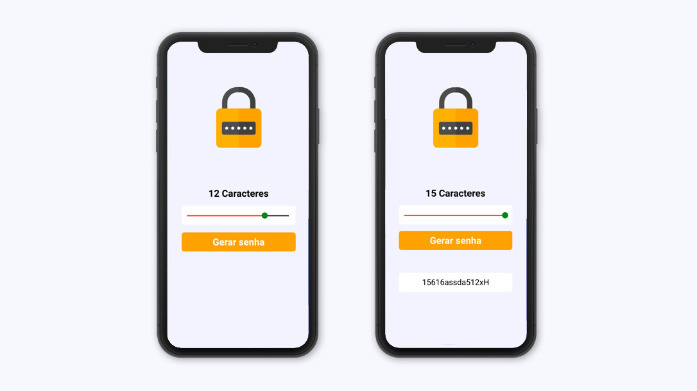

# Gerador de senhas

  

Um aplicativo que gera senhas aleatórias. O usuário define, através de um slider, a quantidade de caracteres que a senha terá e o app gera uma senha aleatória com a quantidade de caracteres definida.  

### Técnologias utilizadas:

* React Native 
* Expo
